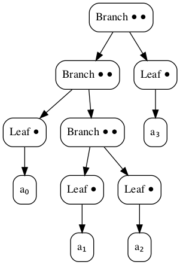
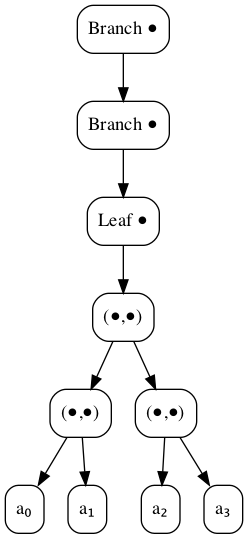
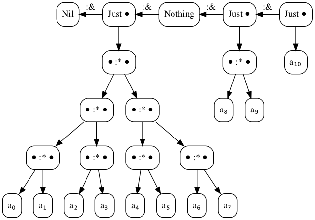

I want to talk about my current favorite data structure.

First, some background.

Binary trees are fairly easy to implement in Haskell:

```haskell
data Tree a = Leaf a | Branch (Tree a) (Tree a)
```



What's slightly trickier is defining a type for **balanced** binary trees.

I've been fascinated by [Edward Z. Yang's solution](http://blog.ezyang.com/2012/08/statically-checked-perfect-binary-trees/#nested-data-types) to this problem using
polymorphic recursion, ever since I read it on his blog:

```haskell
data Tree a = Leaf a | Branch (Tree (a, a))
```



The similarity to the unbalanced tree type is striking, especially if you replace `(,)` with a type for uniform pairs:

```haskell
data Two a = a :* a
infixr 8 :*

-- unbalanced
data Tree a = Leaf a | Branch (Two (Tree a))
-- balanced
data Tree a = Leaf a | Branch (Tree (Two a))
```

With the balanced variant, `Tree a` values look like:

```
Leaf a₀
Branch (Leaf (a₀ :* a₁))
Branch (Branch (Leaf ((a₀ :* a₁) :* (a₂ :* a₃))))
Branch (Branch (Branch (Leaf (((a₀ :* a₁) :* (a₂ :* a₃)) :* ((a₄ :* a₅) :* (a₆ :* a₇))))))
```

We can further restrict the `Tree` type to only balanced trees of `2ᵗ` elements
by introducing a type-level index:

```haskell
data Nat = Z | S Nat

data Tree (t :: Nat) (a :: *) where
  Leaf :: a -> Tree 'Z a
  Branch :: Tree n (Two a a) -> Tree ('S n) a
```

So now the shape of an element of `Tree t a` is uniquely defined by `t`:

```
Leaf a₀ :: Tree 'Z a
Branch (Leaf (a₀ :* a₁)) :: Tree ('S 'Z) a
Branch (Branch (Leaf ((a₀ :* a₁) :* (a₂ :* a₃)))) :: Tree ('S ('S 'Z)) a
Branch (Branch (Branch (Leaf (((a₀ :* a₁) :* (a₂ :* a₃)) :* ((a₄ :* a₅) :* (a₆ :* a₇)))))) :: Tree ('S ('S ('S 'Z))) a
```

On its own, this level of constraint seems of limited use, but it comes into its own as a building block.

Just as we can use `t` bits to represent any natural number less than `2ᵗ`:

```
∀ n ∈ [0, 2ᵗ) ∃ { bᵢ ∈ {0,1} | i ∈ [0, t) } s.t. n = Σ bᵢ 2ⁱ

1 = 0b1 = 1 × 2⁰
13 = 0b1101 = (1 × 2³) + (1 × 2²) + (0 × 2¹) + (1 × 2⁰) 
210 = 0b11010010 = (1 × 2⁷) + (1 × 2⁶) + (0 × 2⁵) + (1 × 2⁴) + (0 × 2³) + (0 × 2²) + (1 × 2¹) + (0 × 2⁰) 
```

We can use up to `t` balanced binary trees to represent collections of less
than `2ᵗ` elements.

```haskell
data Vec (t :: Nat) (a :: *) where
  Nil :: Vec 'Z a
  (:&) :: Vec t (Two a a) -> Maybe a -> Vec ('S t) a

infixl 4 :&
```



If we replace `Maybe` by an indexed variant:

```haskell
data Bit = O | I
data Opt (b :: Bit) a where
  None :: Opt 'O a
  Some :: a -> Opt 'I a
```

Then we can represent collections of exactly `n` elements by replacing the unary representation of `t` with
a binary representation of the `t` bits of `n`:

```haskell
data Binary = Ob | Binary :. Bit
infixl 4 :.

data Vec (n :: Binary) (a :: *) where
  Nil :: Vec 'Ob a
  (:&) :: Vec bs (Two a a) -> Opt b a -> Vec (bs ':. b) a
```

And now we've arrived!


Countable collection types are nothing new in Haskell; commonly showing up using
a linked list representation:

```haskell
data ListVec (n :: Nat) (a :: *) where
  End :: ListVec 'Z a
  Cons :: a -> ListVec n a -> ListVec ('S n) a
```

Though GHC now has its [own built-in type-level
naturals](https://hackage.haskell.org/package/base-4.12.0.0/docs/GHC-TypeLits.html#t:Nat),
a unary representation has the advantage of pattern matching, which can simplify the process of
proving properties, e.g.

```haskell
append :: ListVec m a -> ListVec n a -> ListVec (Sum m n) a
append End v = v
append (Cons a u) v = Cons a (append u v)

type Sum :: Nat -> Nat -> Nat
type family Sum m n where
  Sum 'Z n = n
  Sum ('S m) n = 'S (Sum m n)
```

Using a binary encoding for naturals preserves that pattern-matching property,
with the expense of more complicated cases:

```haskell
combine :: Vec m a -> Vec n a -> Vec (m + n) a
combine = loop None where
  loop :: Opt b a -> Vec m a -> Vec n a -> Vec (AddCarry b m n) a
  loop opt Nil v = check opt v
  loop opt u Nil = check opt u
  loop copt (u :& uopt) (v :& vopt) = loop (carry copt uopt vopt) u v :& least copt uopt vopt

  check :: Opt b a -> Vec n a -> Vec (CheckCarry b n) a
  check None v = v
  check (Some a) v = push a v

  push :: a -> Vec n a -> Vec (Succ n) a
  push a Nil = Nil :& Some a
  push a (v :& None) = v :& Some a
  push a (v :& Some a') = push (a' :* a) v :& None

  carry :: Opt x a -> Opt y a -> Opt z a -> Opt (Carry x y z) (Two a)
  carry _ None None = None
  carry x None (Some a) = fmap (a :*) x
  carry x (Some a) None = fmap (a :*) x
  carry _ (Some y) (Some z) = Some (y :* z)

  least :: Opt x a -> Opt y a -> Opt z a -> Opt (Xor x y z) a
  least x None None = x
  least x None (Some a) = flop x a
  least x (Some a) None =  flop x a
  least x (Some _) (Some _) = x

  flop :: Opt x b -> a -> Opt (Not x) a
  flop None = Some
  flop (Some _) = const None

type (+) :: Binary -> Binary -> Binary
type (+) = AddCarry 'O

type AddCarry :: Bit -> Binary -> Binary -> Binary
type family AddCarry b m n where
  AddCarry b 'Ob n = CheckCarry b n
  AddCarry b m 'Ob = CheckCarry b m
  AddCarry cb (m ':. mb) (n ':. nb) = AddCarry (Carry cb mb nb) m n ':. Xor cb mb nb

type CheckCarry :: Bit -> Binary -> Binary
type family CheckCarry b n where
  CheckCarry 'O n = n
  CheckCarry 'I n = Succ n

type Succ :: Binary -> Binary
type family Succ n where
  Succ 'Ob = 'Ob ':. 'I
  Succ (bs ':. 'O) = bs ':. 'I
  Succ (bs ':. 'I) = Succ bs ':. 'O

type Carry :: Bit -> Bit -> Bit -> Bit
type family Carry x y z where
  Carry b 'O 'O = 'O
  Carry b 'O 'I = b
  Carry b 'I 'O = b
  Carry b 'I 'I = 'I

type Xor :: Bit -> Bit -> Bit -> Bit
type family Xor x y z where
  Xor b 'O 'O = b
  Xor b 'O 'I = Not b
  Xor b 'I 'O = Not b
  Xor b 'I 'I = b

type Not :: Bit -> Bit
type family Not b where
  Not 'O = 'I
  Not 'I = 'O
```

Though this is *considerably* more code, the algorithmic complexity of `+/combine` is
asymptotically less than that of `Sum/append`. It takes O(m) steps to compute `Sum m n`,
but only O(log(max(m,n))) to compute `m + n`.

This algorithmic complexity advantage carries over to other operations too, like indexing:

```haskell
data FBinary (n :: Binary) where
 (:!) :: FBinary bs -> Bit -> FBinary (bs ':. b) 
 Top :: FBinary (bs ':. 'I)

(!) :: Vec n a -> FBinary n -> a
(!) = loop id where
  loop :: (x -> a) -> Vec n x -> FBinary n -> a
  loop f (as :& _) (i :! b) = loop (f . get b) as i
  loop f (_ :& Some x) Top = f x

  get :: Bit -> Two a -> a
  get O (a :* _) = a
  get I (_ :* a) = a
```

`(!)` is O(log n) for `Vec n a`, whereas indexing a `ListVec n a` is O(n).

In the hope that others might enjoy these data structures and algorithms using
type-level binary numbers, I've wrapped them up in a new package, `base₂`.
